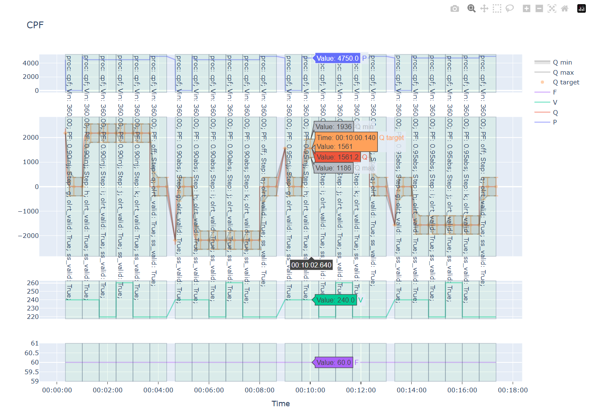

# UL1741SB Compliance Test Suite

Automated testing framework for UL1741SB compliance validation of physical and/or virtual DERs. This repository aims to provide a comprehensive, environment-agnostic test suite for verifying IEEE 1547-2018 and UL1741SB compliance.

## 📋 Current Status

### ✅ Completed
- **Split-phase Category III-B ramp-start** inverters
- Core test infrastructure and framework
- EPRI Open DER simulation model validation
- Custom UL1741SB-compliant controller validation

### ⚠️ Implemented but Untested
- Other DER categories (Category A)
- Other abnormal operating performance categories (I, II)

### 🚫 Not Yet Implemented
- Three-phase exclusive test steps
- Randomized-delay start

## 🎯 Features

- **Environment Agnostic**: Can run in SVP (SunSpec Virtual Platform) but doesn't require it
- **Real & Virtual Device Support**: Test physical or virtual DERs
- **Reference Implementations**: Includes validated test cases for EPRI openDER models and a custom controller I wrote
- **Plotly** powered interactive [results](cpf.html) visualization

## 🔧 Comparison with Sandia's IEEE 1547 Repository
Sandia Labs has a similarly oriented [repo](https://github.com/sandialabs/svp_1547.1) designed to work with SVP which I originally tried to use. However, it has some problems. Notably, it does not validate open loop response correctly. I gave up trying to fix it due to readability issues, which then resulted in this repo. 

## 🚀 Getting Started

### Prerequisites

- Python 3.7 or higher
- `pip install -r requirements.txt`
- Look in the `tests` folder for examples to get started

### Disclaimers
Users are responsible for correctly validating their devices in a safe manner. 

